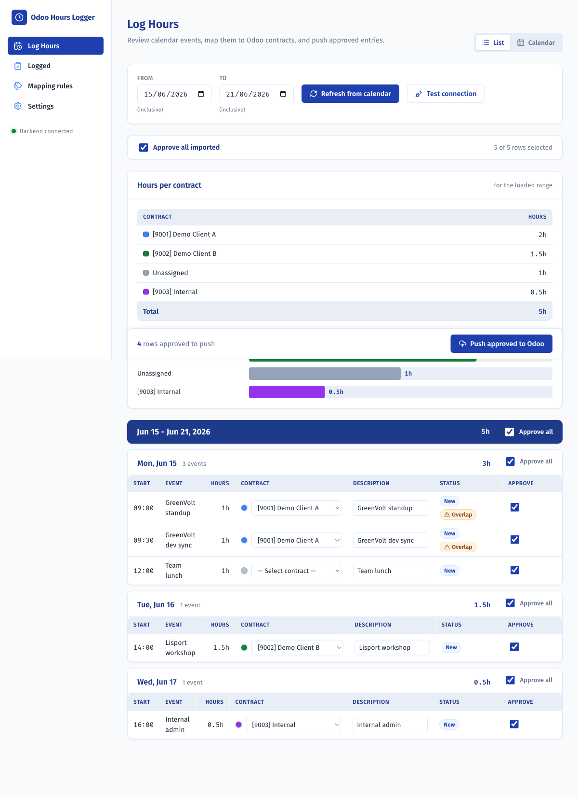
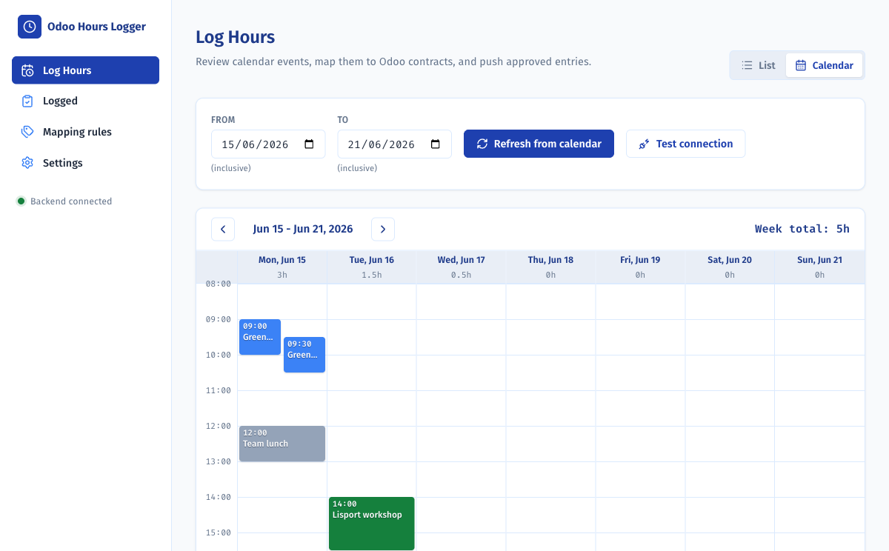
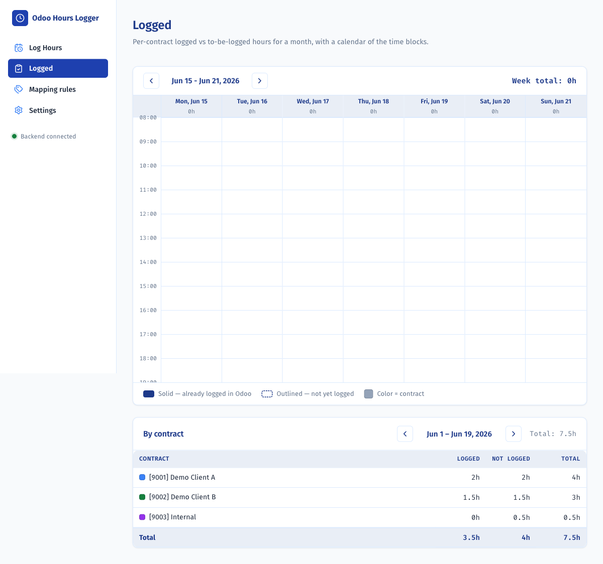
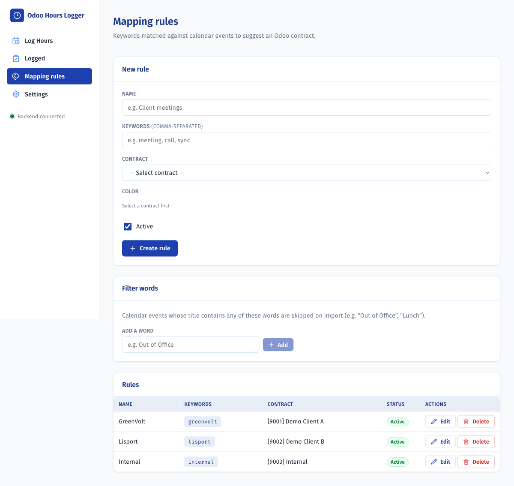
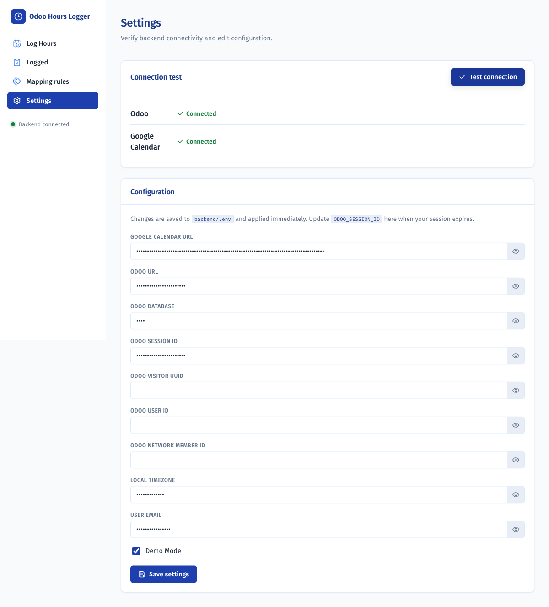

<div align="center">


# Odoo Hours Logger

**Turn your Google Calendar into Odoo timesheets — review, then push, in a couple of clicks.**


</div>

> Reads your Google Calendar, maps each event to an Odoo **contract** via keyword rules, lets you
> **review** the proposed entries, then **pushes** them to Odoo's timesheet. Runs entirely locally —
> no database, no LLM. Plain keyword matching, plain JSON state files.

<p align="center">
  
</p>

<p align="center"><sub>All screenshots use built-in <b>demo data</b>.</sub></p>

## ✨ Features

- 📅 **Calendar import** from your Google Calendar's secret iCal URL — recurring events expanded; all-day & declined events skipped.
- 🏷️ **Keyword → contract rules** with per-contract **colors**; events auto-match as you type a range.
- ✅ **Review, then push** — global / per-week / per-day / per-row approve, with dedup so you never double-log.
- 🗓️ **List _and_ calendar views**, colour-coded by contract, with side-by-side overlaps.
- 📊 **Logged overview** — per-contract **logged vs. to-be-logged** hours, month-to-date.
- 🧹 **Filter words** to skip non-work events (e.g. _"Out of Office"_, _"Lunch"_).
- ⚙️ **Editable, masked settings** saved to `.env` — re-paste your Odoo session here when it expires.
- 🔌 **Session-cookie Odoo auth** (no API key needed) with a clear **"check your VPN"** prompt when Odoo is unreachable.
- 🧪 **Demo mode** + a full test suite (**111** backend, **110** frontend).

## 📸 Screenshots

<table>
  <tr>
    <td width="50%"></td>
    <td width="50%"></td>
  </tr>
  <tr>
    <td align="center"><b>Calendar view</b> — blocks colour-coded by contract</td>
    <td align="center"><b>Logged</b> — logged vs. to-be-logged per contract</td>
  </tr>
  <tr>
    <td width="50%"></td>
    <td width="50%"></td>
  </tr>
  <tr>
    <td align="center"><b>Mapping rules</b> — keyword → contract + filter words</td>
    <td align="center"><b>Settings</b> — masked config, editable, saved to <code>.env</code></td>
  </tr>
</table>

## 🚀 Quick start

```bash
# 1. Backend
cd backend && python -m venv .venv && . .venv/bin/activate && pip install -e ".[dev]"

# 2. Frontend
cd ../frontend && npm install

# 3. Config — copy the template and fill it in (or edit later in the Settings tab)
cp backend/.env.example backend/.env

# 4. Run both (backend :8010 + frontend :5173)
./run.sh
```

Then open **http://localhost:5173**.

**Just want to look around?** Set `DEMO_MODE=true` in `backend/.env` — the app runs on sample
contracts and events with a simulated push (no Odoo or calendar needed). All the screenshots above
are demo mode.

> **Configuration:** the key values are your Google Calendar **secret iCal URL** and your Odoo
> **`session_id`** cookie (this Odoo has no API keys, so auth reuses your browser session — it
> expires, and you re-paste it in the Settings tab). Full variable reference and the technical
> details are in **[`docs/GUIDE.md`](docs/GUIDE.md)**.

## 🧭 How it works

1. **Import** — pick a date range, _Refresh from calendar_; events are fetched from the iCal URL and parsed.
2. **Match** — keyword rules map each event title to an Odoo contract (first matching rule wins); filter words drop noise.
3. **Review** — adjust contracts/descriptions, remove stray events, approve what you want.
4. **Push** — approved entries are created in Odoo (`timesheet_entry`); already-logged rows are greyed out so re-imports never double-log.

Full technical walkthrough — Odoo session auth, how contracts are fetched, calendar parsing, rules,
dedup, the Logged overview — in **[`docs/GUIDE.md`](docs/GUIDE.md)**.

## 🛠️ Tech stack

**Backend:** Python 3.12 · FastAPI · httpx · icalendar + recurring-ical-events · Odoo web JSON-RPC ·
plain JSON files (no database).
**Frontend:** React · TypeScript · Vite · plain CSS design system.
**Tests:** pytest (backend) · Vitest + React Testing Library (frontend).

## ✅ Tests

```bash
cd backend && . .venv/bin/activate && pytest    # 111 passing
cd frontend && npm test                          # 110 passing
```
